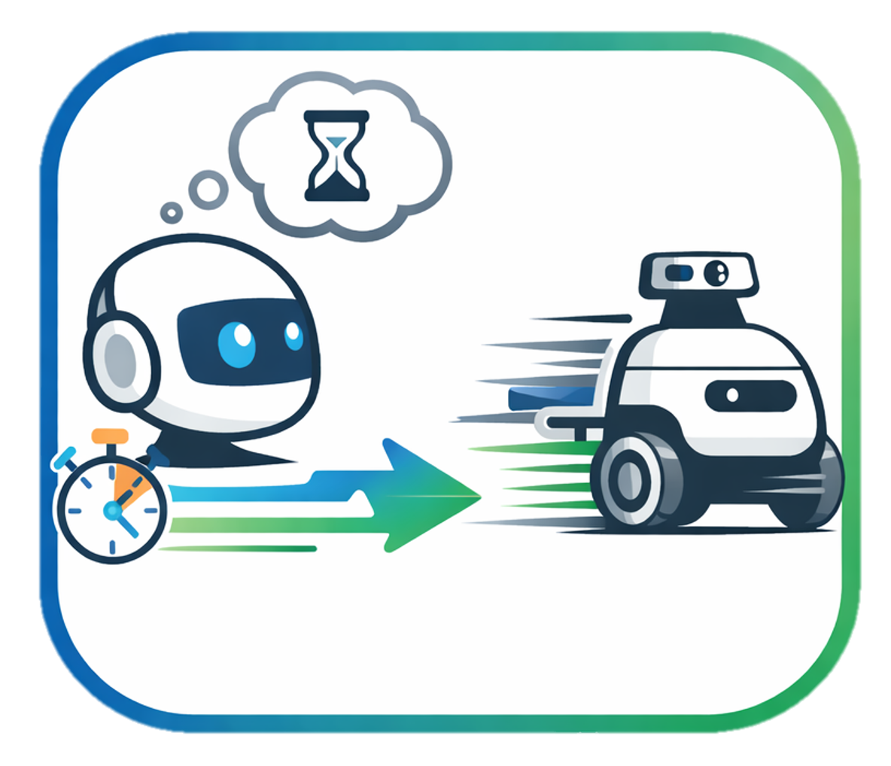
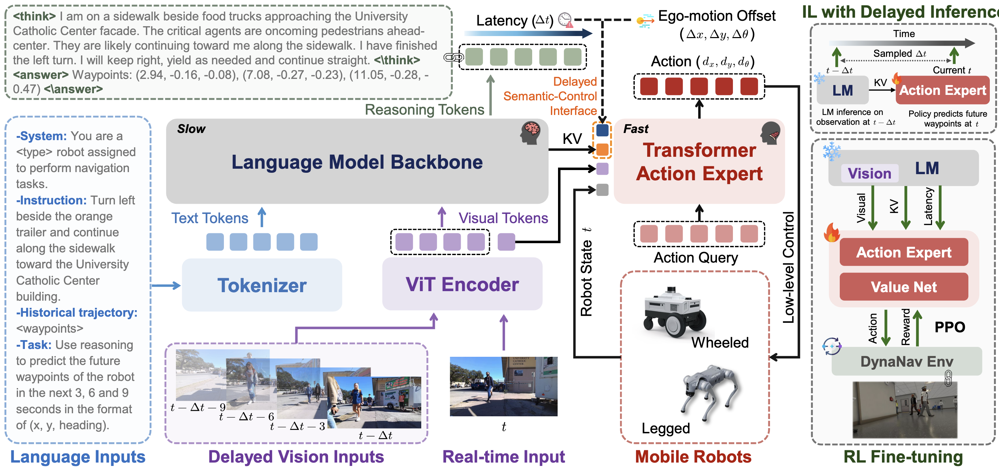
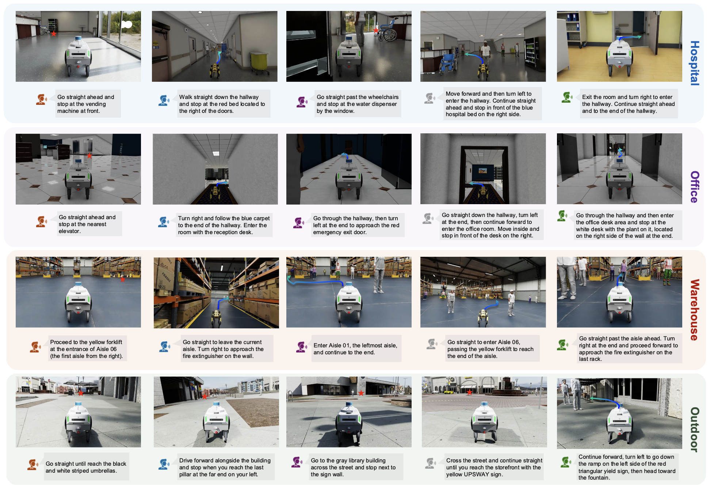

#  TIC-VLA

<!--  -->

<!-- This is the official implementation for the following paper: -->

**TIC-VLA: A Think-in-Control Vision-Language-Action Model for Robot Navigation in Dynamic Environments**

**[Zhiyu Huang](https://mczhi.github.io/)**†, **[Yun Zhang](https://handsomeyun.github.io/)**†, [Johnson Liu](https://www.linkedin.com/in/johnsonliu367/), [Rui Song](https://rruisong.github.io/), [Chen Tang](https://chentangmark.github.io/), [Jiaqi Ma](https://mobility-lab.seas.ucla.edu/about/)  

University of California, Los Angeles (UCLA)  
† Equal contribution

---

## Overview

Stay tunned for future updates!

TIC-VLA introduces a **latency-aware Think-in-Control (TiC) architecture** for vision-language-action (VLA) navigation in **dynamic, human-centric environments**.  

- 🧠 **Think-in-Control Architecture**  
  Decouples slow vision-language reasoning from fast reactive control through an explicit **delayed semantic–control interface**.

- ⏱️ **Latency-Aware Action Generation**  
  Conditions control on current observations, cached VLM hidden states, and explicit delay metadata to mitigate stale semantics.

- 🧪 **Latency-Consistent Training Pipeline**  
  Combines vision-language reasoning distillation, latency-induced imitation learning, and online reinforcement learning.

- 🚶 **Dynamic, Human-Centric Navigation**  
  Evaluated in physics-accurate, photo-realistic environments with human-robot interactions and long-horizon instructions.

---

## Benchmark: DynaNav

We introduce **DynaNav**, a realistic language-conditioned navigation benchmark with human-robot interactions.

- 85 task configurations across **Hospital**, **Office**, **Warehouse**, and **Outdoor** scenes
- Varying **crowd density**, **navigation distance**, and **scene layout**

